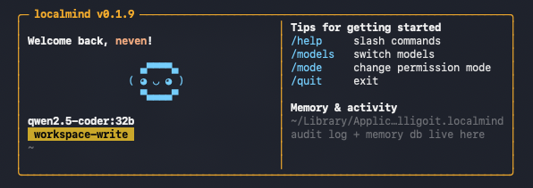

# localmind

Run any local LLM with persistent memory.



## What it is

A single CLI binary (`llm`) that turns an [Ollama](https://ollama.com)-served
model into an interactive agent with long-term memory, learnable skills, and
permissioned tools. Everything runs on your machine — no cloud, no telemetry,
no dependencies beyond Ollama.

## What it does

- Talk to any local chat / vision / embedding model Ollama has installed.
- Remember what you tell it across sessions. Facts, decisions, skills,
  embeddings, an entity graph — all in one SQLite file you can back up
  or move.
- Recall relevant prior context automatically at the start of every turn
  via a hybrid BM25 + vector + graph retriever.
- Resume each session where you left off, per working directory.
- Read files, PDFs, docx, xlsx, images. Describe images with vision models.
- Run shell, networking, and web tools with per-call permission prompts and
  a hard credential deny-list.

## How it works

```
you type  ─►  auto-extract facts  ─►  hybrid recall  ─►  agent loop  ─►  streamed reply
                    │                       │                 │
                    ▼                       ▼                 ▼
              SQLite memory.db      BM25 + vector +       tool calls
                                    graph, fused by RRF
```

1. **Auto-extract.** A regex catches obvious directives (`my name is X`,
   `call me X`, `remember X`) before the model sees the turn. Stored
   regardless of whether the model would have called `store_memory`.
2. **Recall.** Three retrievers run concurrently: BM25 (FTS5), vector
   ANN (sqlite-vec), and optional graph retrieval (Personalized PageRank
   over the entity graph). Results are fused via Reciprocal Rank Fusion —
   rank-based, parameter-free — then pruned by temporal decay. An optional
   LLM-as-judge reranker can rescore the top N before the final cut.
   Trivial turns (`hi`, `ok`, `thanks`) skip recall entirely.
3. **Agent loop.** The model sees tool specs and may call `read_file`,
   `shell`, `web_fetch`, `store_memory`, etc. Side-effecting tools are
   gated by the permission mode and / or prompt before running.
4. **Streamed reply.** Tokens are printed as they're generated — no long
   "thinking…" pause before the wall of text drops. Reasoning-model
   chain-of-thought (`<think>…</think>`) is filtered out; only the final
   answer reaches the transcript.
5. **Persistence.** Conversation messages, new memories, and extracted
   entities are written back to SQLite. Embedding + entity extraction
   run on a background worker so turns never wait on them.
6. **Context care.** When the live message history approaches `num_ctx`,
   a summariser compacts the oldest middle messages into a single system
   message automatically — the system prompt and last few turns stay
   verbatim. `/compact` triggers manually.

## Features

### Memory

- **Portable.** Single SQLite file; `llm backup` / `llm restore` copy it
  cleanly between machines. No re-teaching.
- **Hybrid recall.** BM25 + vector ANN + optional graph retrieval, fused
  by Reciprocal Rank Fusion. Rank-based fusion removes the "tune the
  weights" problem that plagues score-based setups.
- **Graph retrieval (opt-in).** Entities and relationships extracted from
  each memory populate a knowledge graph. Personalized PageRank seeded
  from query entities finds memories that are multi-hop related even
  when they share no keywords.
- **Contextual embeddings (opt-in).** A one-sentence model-generated
  context line is prepended to each memory before embedding — improves
  recall on short or ambiguous notes.
- **LLM-as-judge reranker (opt-in).** A small instruct model can rescore
  the top-N candidates in a single batched call before the final cut.
- **Temporal decay.** Older memories fade in ranking; the half-life is
  configurable.
- **Learnable skills.** Tell it _"from now on when X, do Y"_ — stored as
  a `kind="skill"` memory, surfaced automatically on matching turns.
- **Session persistence.** Each working directory gets its own persistent
  conversation thread. Re-launching `llm` in the same directory resumes
  the last N messages. `/new` (aliases `/clear`, `/reset`) starts fresh.
- **Auto-compaction.** In-session message history is summarised
  automatically when it approaches `num_ctx`. `/compact` triggers manually.

### Agent behaviour

- **Reasoning-model aware.** `<think>…</think>` blocks are stripped from
  the streamed transcript so users see the final answer only.
- **Narrated-write detector.** Some models describe file writes by
  printing numbered diff rows in prose instead of actually calling
  `write_file`. When detected, the agent nudges the model once per turn
  to call the tool for real.
- **Streaming responses.** Tokens appear in real time.
- **Fast repeat turns.** `keep_alive: 30m` stops Ollama from unloading
  the model between turns; no cold-load per message.
- **Cascade router.** Optional two-model setup: short / chatty turns and
  auxiliary calls (query expansion, etc.) run on a small `fast_model`;
  code-heavy or long turns route to the configured `chat_model`.
  `/retry-big` manually escalates the last turn when the router picked
  wrong.

### Tools & safety

- **Safe-by-default tools.** Workspace-confined writes, SSRF guard on
  `web_fetch` and `whois`, destructive-pattern detection on `shell`,
  credential deny-list that's always on.
- **Interactive permission grants.** When the model wants to write / run
  something it isn't pre-approved for, you get a prompt:
  `[y]es  [a]lways this session  [f]orever  [n]o  [e]dit(reason)`.
  Pick `forever` and the grant is saved to your config (comment-preserving
  toml_edit — other settings untouched) so the next session starts
  already pre-approved.
- **Permission modes.** `read-only`, `workspace-write` (default),
  `unrestricted`. Switch mid-session with `/mode`.

### Operations

- **Self-updating.** Daily background check for a newer release;
  `llm update` re-runs the installer in place.
- **Model picker.** `llm models` lists installed Ollama models and lets
  you set chat / vision / embed non-interactively or via a picker.
- **Inspectable.** `llm health` reports DB, embedder, and Ollama state.
  `/recall <q>`, `/context`, `/audit` expose what the model is actually
  seeing. JSONL audit log of every tool call.

---

## Install

One-liner (macOS arm64, Linux x86_64/arm64). Downloads the latest release
binary, verifies SHA256, installs to `~/.local/bin/llm`, installs Ollama
(headless CLI via Homebrew on macOS, official installer on Linux), starts
the server, and pulls the default chat + embed models:

```bash
curl -fsSL https://raw.githubusercontent.com/nevenkordic/localmind/main/install.sh | sh
```

**Environment overrides:**

| var                         | what                                                  |
|-----------------------------|-------------------------------------------------------|
| `LOCALMIND_INSTALL_DIR`     | install target (default `$HOME/.local/bin`)           |
| `LOCALMIND_VERSION`         | pin a release tag (default `latest`)                  |
| `LOCALMIND_CHAT_MODEL`      | override the chat model the installer pulls           |
| `LOCALMIND_EMBED_MODEL`     | override the embed model the installer pulls          |
| `LOCALMIND_OLLAMA_GUI=1`    | install the full Ollama.app (macOS cask)              |
| `LOCALMIND_SKIP_OLLAMA=1`   | don't install or start Ollama                         |
| `LOCALMIND_SKIP_MODELS=1`   | don't pull models (saves ~5 GB on metered)            |

**Build from source** (Intel Mac / Windows, or if you don't want the release
binary):

```bash
git clone https://github.com/nevenkordic/localmind
cd localmind
./scripts/install.sh        # macOS / Linux
.\scripts\install.ps1       # Windows
```

## Use

```bash
llm                          # interactive REPL, resumes last session for cwd
llm ask "fix the failing test"
llm health                   # DB stats, Ollama reachability, recall config
llm memory search "deploy procedure"
llm memory search "deploy procedure" --bm25    # skip embedding (fast)
llm memory reembed           # re-run the embedding + extraction pipeline
llm memory reindex           # rebuild the ANN index over existing vectors
llm memory stats             # counts: memories, vectors, entities, edges
llm models                   # pick chat / vision / embed models
llm backup [<path>]          # copy memory DB to a file
llm restore <path>           # replace memory DB from a backup
llm update                   # grab a newer release
```

**REPL slash commands:**

```
/help    /quit    /init    /stats    /health    /audit
/config  /tools   /mode    /model
/skills  /forget <id>  /remember <fact>
/recall <query>  /context
/compact                        summarise history now (auto-fires near num_ctx)
/new     /clear   /reset        wipe this session's history, start fresh
/retry-big                      re-run the last turn on chat_model
```

## Configure

```bash
cp config/config.example.toml config/local.toml
```

### `[ollama]`

| key                 | effect                                                   |
|---------------------|----------------------------------------------------------|
| `chat_model`        | capable model — used for code / tools / long prompts     |
| `fast_model`        | optional small model for short turns + auxiliary calls   |
| `vision_model`      | used when a turn includes image input                    |
| `embed_model`       | used by the memory index                                 |
| `num_ctx`           | per-reply token budget                                   |
| `keep_alive`        | how long Ollama holds the model in RAM (default 30m)     |
| `temperature`       | sampling temperature                                     |
| `top_p`             | nucleus sampling                                         |
| `auto_compact_at`   | compaction threshold as fraction of `num_ctx` (0 = off)  |
| `compact_keep_tail` | messages preserved verbatim at the tail on compaction    |
| `resume_messages`   | messages to reload from previous session per cwd (0 = off) |

### `[memory]`

| key                    | effect                                                   |
|------------------------|----------------------------------------------------------|
| `vector_search`        | `false` = pure BM25 recall (~10× faster, less semantic)  |
| `expansion_variants`   | LLM query paraphrasings (0 = off; uses `fast_model`)     |
| `temporal_half_life_days` | how fast old memories decay in ranking                |
| `auto_persist`         | auto-summarise turns into memories                       |
| `contextual_embed`     | prepend a model-generated context line before embedding  |
| `entity_extraction`    | populate the entity graph from each new memory           |
| `graph_search`         | PPR-based graph retriever in the fusion mix              |
| `rerank_model`         | LLM-as-judge reranker model (empty = disabled)           |
| `rerank_fetch_k`       | candidate pool size when reranking                       |
| `bm25_weight` / `vector_weight` | legacy score-fusion weights; ignored (RRF now)  |

### `[tools]`

| key              | effect                                                       |
|------------------|--------------------------------------------------------------|
| `mode`           | `read-only` / `workspace-write` / `unrestricted`             |
| `workspace_root` | confines writes to a directory tree                          |
| `deny_globs`     | extra paths to refuse                                        |
| `allow_rules`    | auto-approve patterns (populated by `[f]orever` grants)      |
| `deny_rules`     | hard refusals                                                |
| `ask_rules`      | always prompt, even when allowed elsewhere                   |

### `[web]`

| key                   | effect                                                  |
|-----------------------|---------------------------------------------------------|
| `brave_api_key`       | enables `web_search`                                    |
| `block_private_addrs` | refuse fetches to RFC1918 / metadata IPs                |

Env vars override: `LOCALMIND_CHAT_MODEL`, `LOCALMIND_DB_PATH`,
`BRAVE_API_KEY`, `LOCALMIND_NO_UPDATE_CHECK`, etc.

### Permission modes

```
read-only          no writes, no shell mutations, no outbound network
workspace-write    writes confined to workspace_root; shell/web prompt
unrestricted       prompts only; no extra guard-rails
```

Switch mid-session with `/mode <ro|ww|full>`. Default in `[tools].mode`.

## Backup / move to another machine

The memory DB is a single SQLite file — everything the agent knows lives there.

```bash
llm backup                          # ~/localmind-backup-YYYYMMDD-HHMMSS.db
llm backup /path/to/somewhere.db    # explicit destination

# On the other machine:
llm restore /path/to/somewhere.db   # prompts y/N before overwriting
```

`backup` uses SQLite's `VACUUM INTO` — safe while localmind is running.
`restore` keeps your previous DB at `memory.db.bak-YYYYMMDD-HHMMSS` so repeat
restores never clobber each other's rollback points.

After a restore, or after changing `embed_model` / enabling
`contextual_embed`, run `llm memory reembed` to regenerate vectors
against the current settings.

## Update

`localmind` checks GitHub for a newer release once every 24 hours (background,
non-blocking). When one is available, you see this at startup:

```
↑ v0.2.0 available (you have 0.1.6) — run 'llm update' to upgrade
```

Then:

```bash
llm update            # re-runs install.sh
llm update --force    # reinstall even when on latest
```

Disable with `[updates] check = false` or `LOCALMIND_NO_UPDATE_CHECK=1`.

## Uninstall

```bash
curl -fsSL https://raw.githubusercontent.com/nevenkordic/localmind/main/uninstall.sh | sh
```

Removes the binary and strips the PATH line. Your memory DB and audit log are
**kept**. Opt-in flags: `LOCALMIND_PURGE_DATA=1` wipes the memory DB;
`LOCALMIND_PURGE_MODELS=1` runs `ollama rm` on the default models. Ollama
itself is never removed.

## Where things live

```
~/Library/Application Support/com.calligoit.localmind/   macOS
~/.local/share/localmind/                                Linux
%LOCALAPPDATA%\localmind\                                Windows
  ├── memory.db       facts, skills, embeddings, KG, session history
  ├── audit.log       JSONL log of every tool call
  └── history.txt     REPL history (mode 0600 on Unix)
```

`llm health` prints the resolved paths.

## Development

```bash
cargo test                 # unit + smoke + e2e
bash scripts/preflight.sh  # full pre-ship verification
cargo build --release      # binary at target/release/llm
```

## License

MIT — see [LICENSE](LICENSE).
